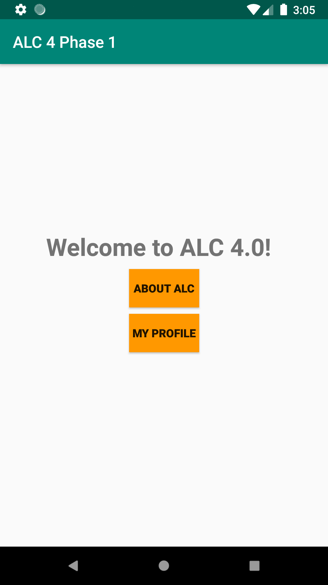
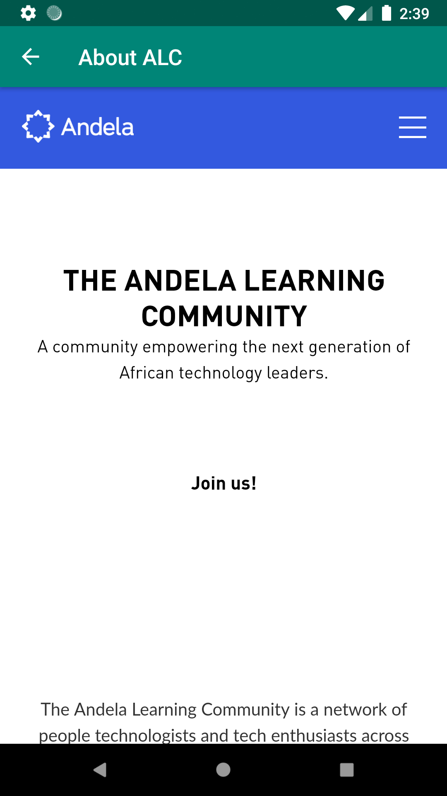
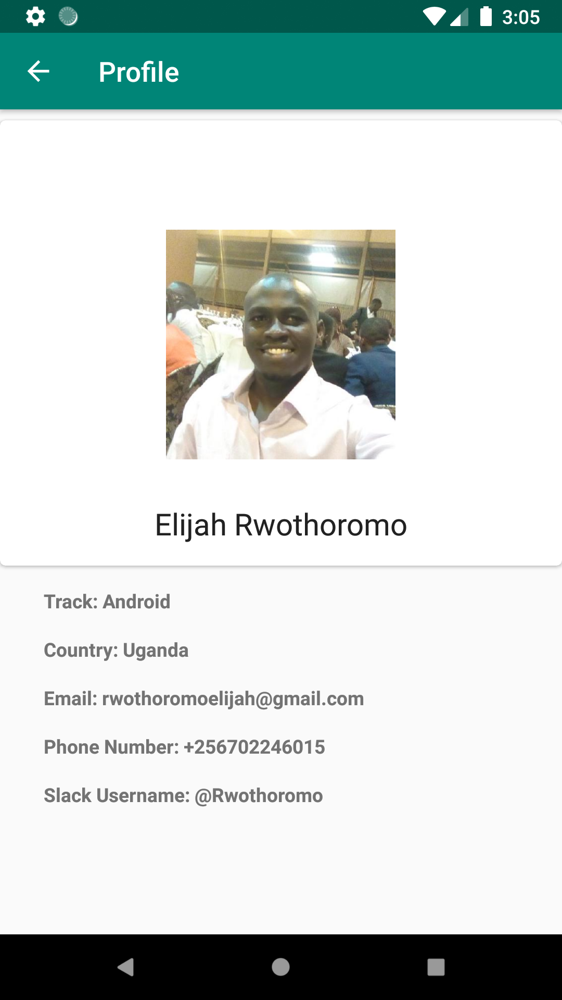

# ALC Challenge 1

This is a solution to ALC (Andela Learning Community) Phase 1 Android challenge

## Activities provided

The following pages/activities are provided:

| 1. Main Activity.                                 | 2. About ALC.                             | 3. Profile                             |
| ------------------------------------------------- | ------------------------------------------| -------------------------------------- |
|  |  |  |

## Set-up

 - Run `$ git clone https://github.com/Rwothoromo/Android-Codelab.git`
 - Open the project in [Android Studio](https://developer.android.com/studio, run and test it.
